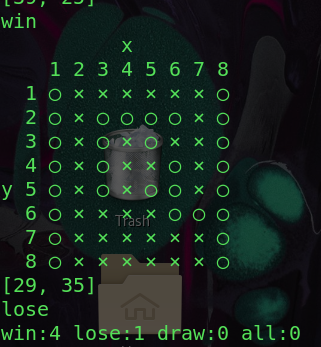
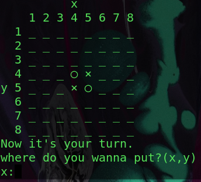
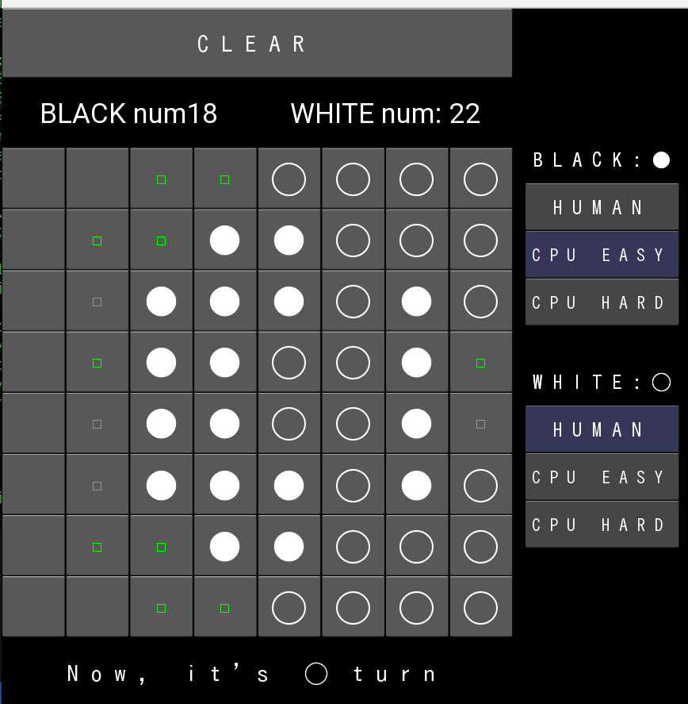

# Reversi
- オセロの学習を通じて、いろいろなことを学ばせてもらった
  - オセロ実装
  - pythonにおけるGUI(kiviy)
  - 機械学習(dqnの実装)

## ファイル説明
- cpu_cpu.py
  - cpuとcpuがターミナルで戦うファイル
  - 記録するかと何回対戦するかが選べる
  - `python cpu_cpu.py`
  

- random_main.py
  - ランダムに打ってくるCPUと戦える
  - `python random_main.py`
  

- weight_1.py
  - [ある法則](https://uguisu.skr.jp/othello/5-1.html)に従って打ってくるCPUとの戦い
  - ターミナル上
  - `python weight_1.py`

- kivy/reversi.py
  - GUIでコンピュータと戦える
  - ランダム(EASY)かDQNで強くした敵(HARD)か選べる
  - `python ./kivy/reversi.py`
  

## 強化学習やってみた

### What have I done
- This mode is trained by machine learning.
- The source code is in /learning folder.
- This model is trained using 10000*4 matches.

### vs random computer 300 matches:
|win|lose|draw|
|---|---|---|
|261|36|3|

### cf. weight method
vs computer following [this method](https://uguisu.skr.jp/othello/5-1.html) 300 matches:
|win|lose|draw|
|---|---|---|
|218|70|2|

## その他

### Tic_Tac_Toe
- 英語で三目並べって意味らしい
- 入門で、三目並べで`Q-learning`やってみた
- これくらいまでの状態数なら普通のQ-learningでいける
  - オセロぐらいになると状態数が爆発するので、もうひと工夫必要
    - DQNなど

