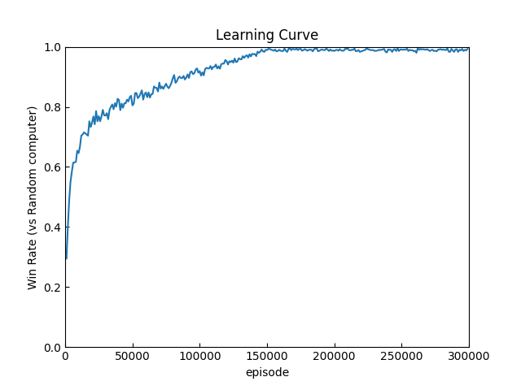

# Tic Tac Toe (三目並べ)

## [main.py](./main.py)
三目並べに必要なクラス

## [learning.py](./learning.py)
強化学習で強くするためのファイル

以下のような学習曲線を描いた

## [learner_vs_random.py](./learner_vs_random.py)
上で強くしたテーブルを元にランダムな CPU と対戦を行うファイル

上での例だと強化した人目線で以下のようになった（10000 戦）

| 勝ち | 負け | 引き分け |
| --- | --- | --- |
| 8961 | 574 | 464 |
